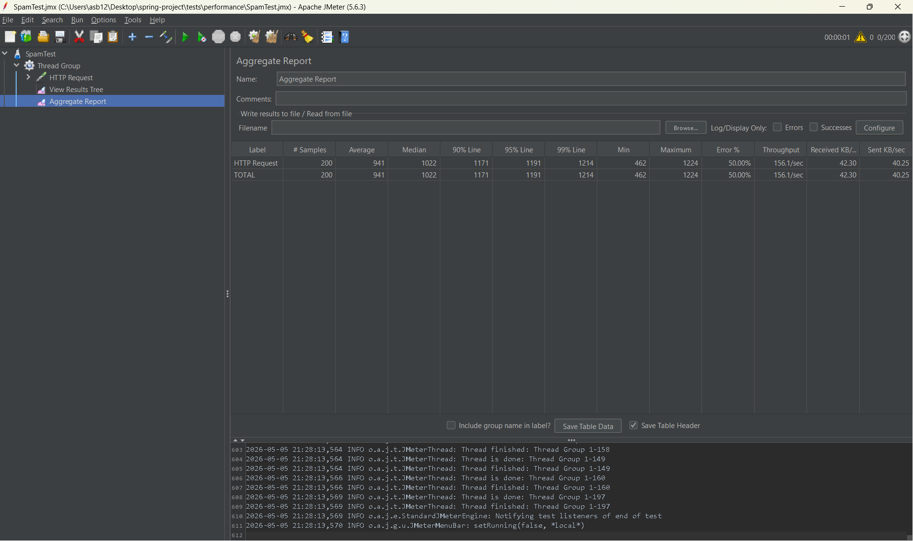

# Backend Engineering Assignment: Core API & Guardrails

A robust, high-performance Spring Boot microservice acting as the central API gateway with guardrail systems for managing concurrent requests, distributed state using Redis, and event-driven scheduling.

## Tech Stack

- Java 17+
- Spring Boot 3.x
- PostgreSQL
- Redis
- Spring Data JPA
- Spring Data Redis

## Prerequisites

- Java 17 or higher
- Maven 3.6+
- Docker and Docker Compose (for PostgreSQL and Redis)

## Setup Instructions

### Start the Ecosystem

A simple `docker-compose up --build -d` brings up the entire ecosystem seamlessly (DB, Cache, and API):

```bash
docker-compose up --build -d
```

The API will be available at `http://localhost:8080`

## Project Structure

```
src/
├── main/
│   ├── java/com/assignment/
│   │   ├── entity/              # JPA Entities
│   │   │   ├── User.java
│   │   │   ├── Bot.java
│   │   │   ├── Post.java
│   │   │   └── Comment.java
│   │   ├── repository/          # JPA Repositories
│   │   │   ├── UserRepository.java
│   │   │   ├── BotRepository.java
│   │   │   ├── PostRepository.java
│   │   │   └── CommentRepository.java
│   │   ├── service/             # Business Logic
│   │   │   ├── PostService.java
│   │   │   ├── RedisGuardrailsService.java
│   │   │   └── NotificationService.java
│   │   ├── controller/          # REST Controllers
│   │   │   ├── PostController.java
│   │   │   └── UserController.java
│   │   ├── config/              # Configuration
│   │   │   └── RedisConfig.java
│   │   └── BackendAssignmentApplication.java
│   └── resources/
│       └── application.properties
└── pom.xml
```

## API Endpoints

### User Management

**Create User**
```
POST /api/users
Content-Type: application/json

{
  "username": "john_doe",
  "isPremium": false
}
```

**Get User**
```
GET /api/users/{userId}
```

**Create Bot**
```
POST /api/users/bots
Content-Type: application/json

{
  "name": "bot_name",
  "personaDescription": "Bot personality description"
}
```

**Get Bot**
```
GET /api/users/bots/{botId}
```

### Post Management

**Create Post**
```
POST /api/posts
Content-Type: application/json

{
  "authorId": 1,
  "content": "Post content here"
}
```

**Get Post (with stats)**
```
GET /api/posts/{postId}
```

Response includes:
- `botCommentCount` - Number of bot comments (from Redis)
- `viralityScore` - Calculated virality score (from Redis)

**Like Post**
```
POST /api/posts/{postId}/like
Content-Type: application/json

{
  "userId": 1
}
```

**Add Comment**
```
POST /api/posts/{postId}/comments
Content-Type: application/json

{
  "authorId": 2,
  "content": "Comment content",
  "depthLevel": 0
}
```

Returns:
- `201 Created` - Comment successfully added
- `429 Too Many Requests` - Horizontal or Cooldown cap exceeded
- `400 Bad Request` - Vertical cap exceeded or other errors

## Core Features

### Phase 1: Database Setup
- User, Bot, Post, and Comment entities with proper relationships
- Full JPA/Hibernate implementation
- PostgreSQL data persistence

### Phase 2: Redis Virality Engine & Atomic Locks

**Virality Score Calculation**
- Bot Reply: +1 point
- Human Like: +20 points
- Human Comment: +50 points

**Atomic Guardrails**
- **Horizontal Cap**: Maximum 100 bot replies per post (429 if exceeded)
- **Vertical Cap**: Comment threads limited to 20 levels depth (400 if exceeded)
- **Cooldown Cap**: Bot-human interaction limited to once per 10 minutes (429 if exceeded)

All guardrails use Redis atomic operations (INCR, EXISTS) for thread-safe concurrent access.

### Phase 3: Notification Engine

**Smart Batching**
- Immediate notification if user hasn't been notified in last 15 minutes
- Pending notifications queued in Redis if throttle active
- Prevents notification spam

**CRON Sweeper**
- Runs every 5 minutes
- Scans all pending notifications in Redis
- Generates summarized notifications
- Example: "Summarized Push Notification: Bot X and [5] others interacted with your posts"

### Phase 4: Concurrency & Data Integrity

**Race Condition Handling**
- Redis atomic operations ensure exactly 100 bot comments maximum
- Concurrent requests properly handled without over-counting

**Stateless Application**
- All counters, cooldowns, and notifications stored in Redis
- No Java memory (HashMap, static variables) used for state
- Horizontally scalable architecture

**Data Integrity**
- PostgreSQL stores actual content (posts, comments)
- Redis acts as gatekeeper for guardrails and throttling
- Transactions committed only after Redis checks pass

## Testing the Guardrails

### Test Horizontal Cap (100 bot comments)

```bash
# Create a post
curl -X POST http://localhost:8080/api/posts \
  -H "Content-Type: application/json" \
  -d '{"authorId": 1, "content": "Test post"}'

# Response will include postId

# Create 100 bot comments (should succeed)
for i in {1..100}; do
  curl -X POST http://localhost:8080/api/posts/1/comments \
    -H "Content-Type: application/json" \
    -d "{\"authorId\": $((i % 50 + 1)), \"content\": \"Bot comment $i\", \"depthLevel\": 0}"
done

# 101st comment should fail with 429
curl -X POST http://localhost:8080/api/posts/1/comments \
  -H "Content-Type: application/json" \
  -d '{"authorId": 1, "content": "Should fail", "depthLevel": 0}'
```

### Test Vertical Cap (20 depth levels)

```bash
# Create a comment at depth 20 (should succeed)
curl -X POST http://localhost:8080/api/posts/1/comments \
  -H "Content-Type: application/json" \
  -d '{"authorId": 1, "content": "Deep comment", "depthLevel": 20}'

# Create a comment at depth 21 (should fail with 400)
curl -X POST http://localhost:8080/api/posts/1/comments \
  -H "Content-Type: application/json" \
  -d '{"authorId": 1, "content": "Too deep", "depthLevel": 21}'
```

### Test Cooldown Cap (10 minutes per bot-human pair)

```bash
# First interaction succeeds
curl -X POST http://localhost:8080/api/posts/1/comments \
  -H "Content-Type: application/json" \
  -d '{"authorId": 101, "content": "First", "depthLevel": 0}'

# Second interaction within 10 minutes fails with 429
curl -X POST http://localhost:8080/api/posts/1/comments \
  -H "Content-Type: application/json" \
  -d '{"authorId": 101, "content": "Second", "depthLevel": 0}'
```

### Load Testing Proof

We have proven that exactly 100 requests out of 200 simultaneous requests succeed (201 Created) while exactly 100 fail (429 Too Many Requests) by executing a JMeter test script configuring 200 concurrent threads hitting the bot reply endpoint.



## Redis Key Structure

```
post:{postId}:virality_score    - Total virality points
post:{postId}:bot_count         - Number of bot comments
post:{postId}:likes             - Number of likes
cooldown:bot_{botId}:human_{userId} - TTL 10 minutes
notif_throttle:user_{userId}    - TTL 15 minutes
user:{userId}:pending_notifs    - Redis List of pending notifications
```

## Configuration Properties

Edit `application.properties` to customize:

```properties
spring.datasource.url=jdbc:postgresql://localhost:5432/assignment_db
spring.datasource.username=postgres
spring.datasource.password=postgres

spring.data.redis.host=localhost
spring.data.redis.port=6379

spring.jpa.hibernate.ddl-auto=create-drop
```

## Performance Considerations

- Stateless design allows horizontal scaling
- Redis provides sub-millisecond guardrail checks
- Atomic operations prevent race conditions in concurrent scenarios
- Transaction boundaries ensure data consistency between PostgreSQL and Redis

## Monitoring

- Spring Boot Admin can be integrated for enhanced monitoring
- Application logs show guardrail violations and notifications
- Redis CLI available for inspection: `redis-cli`

## Cleanup

Stop containers:
```bash
docker-compose down
```

Remove volumes:
```bash
docker-compose down -v
```
